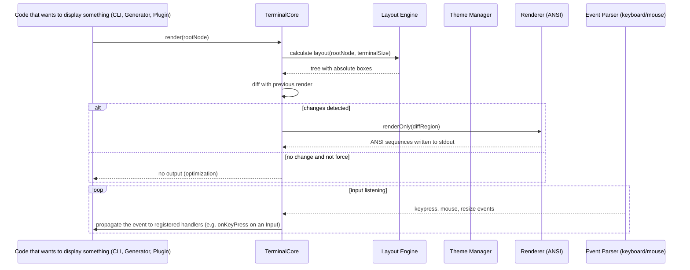

# DXG Terminal Architecture

This document conceptually describes the architecture of DXG's premium terminal rendering system. It remains at the specification level; no implementation is provided.

## Vision
The DXG terminal aims to offer a rich, responsive, and customizable experience comparable to modern terminals like those of Bun, Biome, npm, pnpm, or Turbo, while remaining decoupled from business logic. It must allow displaying colored text, complex layouts, smooth animations, interactive panels, tables and data trees, while supporting keyboard, mouse and resizing. The goal is to provide a presentation layer that other parts of the system (CLI, generators, plugins, AI) can use without needing to know the underlying rendering details (ANSI, SIXEL, advanced terminal protocols, or even a web rendering for a "playground" mode).

## Guiding Principles
1. **Separation of concerns**: the terminal knows nothing of application logic (no direct access to filesystem, workspace, commands, etc.). It only knows how to render a node tree and return input events.
2. **Render-agnostic**: the core defines an abstract interface representation (elements like `Box`, `Text`, `Table`, `Tree`, `Spinner`, `ProgressBar`, `Panel`, `Modal`, `Tooltip`) that can be implemented by different backends (real ANSI terminal, simulator for tests, HTML/CSS rendering for web preview, or even a rich terminal protocol like SIXEL or sixel when available).
3. **Composable and hierarchical**: the interface is built as a tree of nested elements, where each node has layout properties (flex-like, dimensions, margins, padding, alignment) and style properties (colors, borders, line characters).
4. **Hot themeable**: themes (color palettes, border styles, line characters) can be changed in real time without needing to destroy and recreate the entire tree.
5. **Performance through deferred rendering**: only screen regions that are actually modified are rewritten, reducing outbound traffic and avoiding flicker.
6. **Accessibility**: keyboard navigation support (tab, arrows, enter, escape), sufficient default contrast, and possibility to expose ARIA-like roles for screen readers in environments that allow it (e.g. web rendering).
7. **Extensibility**: plugins can register new renderable node types or custom panels that integrate into the render tree.
8. **Non-interactive and CI mode**: when it detects a non-interactive output (no TTY, environment variable `CI=true`), the terminal automatically deactivates and returns simple representations (plain text or JSON) according to configuration.

## Architecture Layers

### 1. Base Renderable Nodes (`RenderableNode`)
All visible elements derive from an abstract class or interface `RenderableNode` possessing:
- `type`: discriminating string identifying the node (`"box"`, `"text"`, `"table"`, etc.).
- `props`: object of type-specific properties (text content, table data, spinner options, etc.).
- `layout`: object describing how the node should be sized and positioned within its parent (flex-grow, flex-shrink, basis, minWidth, maxWidth, height, alignSelf, margin, padding).
- `style`: style object referencing the active theme (foreground and background colors, border style, line characters for borders, optionally shadow or effect).
- `children?`: optional list of `RenderableNode` for nodes that can contain other nodes (e.g. `Box`, `Panel`, `Table` has lines containing cells that can be text or other nodes).

### 2. Layout Engine (`LayoutEngine`)
Given a root node and terminal dimensions (width × height in cells), the layout engine computes the bounding box (x, y, width, height) of each node following a simplified flexbox-type algorithm:
- The main axis (`flexDirection`) can be `column` (default) or `row`.
- Properties `flexGrow`, `flexShrink` and `flexBasis` determine how available space is distributed.
- `alignItems` controls alignment on the secondary axis.
- Absolute dimensions (`width`, `height` in cells) can exceed flex constraints and cause overflow (overflow handling: scrollable, ellipsis, or inheriting parent behavior).
- The engine works in two passes: first to determine minimum/maximum sizes, second to distribute remaining space according to flex factors.
- The result is a tree annotated with absolute render boxes.

### 3. Theme Manager (`ThemeManager`)
A theme is an object containing:
- `palette`: mapping of semantic color names to RGB or ANSI values (`foreground`, `background`, `primary`, `secondary`, `success`, `warning`, `error`, `muted`, `border`, `inputBackground`, etc.).
- `borderStyle`: object defining characters to use for different border types (horizontal, vertical, top-left corner, etc.) – allows switching from simple ASCII style to double style or Unicode characters.
- `cursor`: cursor shape (`block`, `underline`, `beam`) and color.
- `animationSpeed`: multiplicative factor for animation durations (spinners, panel transitions).
The theme manager provides methods:
- `getColor(name: string) => string`: returns the ANSI sequence or CSS value corresponding to the named color.
- `getBorderChar(side: string) => string`: returns the requested border character.
- `applyTheme(theme: Partial<Theme>) => void`: merges the partial theme with the active theme and triggers a re-render of the entire tree (since colors may have changed everywhere).
Themes can be defined in JSON and loaded from a file or provided by a plugin.

### 4. Event Parser (`EventParser`)
The terminal receives raw input from standard input (keyboard, mouse, resizing) as byte sequences (like those emitted by a true VT-compatible terminal). The `EventParser` transforms this sequence into semantic events:
- **Keyboard events**: `keypress` (with properties `key`: key name like `"Enter"`, `"Escape"`, `"ArrowUp"`, `"a"`, `"A"` with shift/ctrl/meta indicator), `keydown`, `keyup` (optional according to desired detail level).
- **Mouse events**: if the terminal supports the mouse protocol (e.g. `X10` or `UTF-8 mouse reporting`), events `mousedown`, `mouseup`, `mousemove` with column/row coordinates and button.
- **Resize events**: `resize` comprising the new width and height in columns/rows.
- **Focus events**: `focus` and `blur` if the terminal supports the notion of focus coming from a window manager (rare in pure text terminals, but useful in web rendering).
The parser must handle escape sequences (ESC `[ …`) and be able to distinguish function keys from ANSI color sequences.

### 5. Backend-Specific Rendering (`Renderer`)
The abstract renderer interface defines how to translate a node tree annotated with their absolute boxes into device-specific outputs. Three main backends are envisaged:
- **ANSI Renderer**: destined for a true VT100/ANSI emulating terminal. It translates each node into an escape sequence to position the cursor (`\x1b[<y>;<x>H`), set colors (`\x1b[38;2;<r>;<g>;<b>m` for foreground, `\x1b[48;2;<r>;<g>;<b>m` for background), draw border characters, fill content, then reset attributes to default.
- **Simulator Renderer**: used during unit tests. It produces no real output but records calls (or builds an in-memory buffer) allowing to assert that certain characters appear at certain coordinates.
- **Web Renderer**: destined for a web preview (e.g. the DXG playground or an IDE integration). It transforms the node tree into a real DOM structure (using HTML/CSS) and renders it in a provided container. This backend allows for rich rendering with fonts, shadows, CSS animations, while reusing the same node tree definition.
Each renderer must respect the same contract: given a root node and terminal dimensions, it returns (or writes to a stream) the visual representation.

### 6. Tree and Deferred Rendering Manager (`TerminalCore`)
The terminal core possesses:
- A reference to the current root node (`root: RenderableNode`).
- The active renderer (`renderer: Renderer`).

It offers a main method:
```ts
render(root: RenderableNode, options?: { force?: boolean }) => void
```
Which:
1. (Optional) executes the layout engine on the new `root` to produce the absolute boxes.
2. Compares the newly calculated absolute boxes with those from the previous render (stored internally).
3. Computes the set of regions that have changed (new nodes, moved nodes, nodes whose content or style changed, deleted nodes).
4. If `options.force` is true or if differences exist, asks the `renderer` to redraw only these regions (or, if force, the entire screen).
5. Updates the cache of absolute boxes for the next render.
6. Optionally returns a promise that resolves when rendering is complete (useful for animations).

The terminal also manages an internal event loop that:
- Reads standard input (in non-blocking mode or via a wrapper that transforms raw data into an event stream thanks to `EventParser`).
- For each semantic event received, distributes it to registered listeners (`onKeyPress`, `onMouseClick`, `onResize`) associated with the root node or specific nodes (via a DOM-like event propagation system: capture → target → bubbling).
- Updates internal state (e.g. active cursor position if an input node like an `Input` is present).
- May request a re-render if the event modified state (e.g. keystroke in a text field).

### 7. Ready-to-Use Rendering Components
The terminal provides a library of high-level components built from the base nodes:

| Component | Description | Typical Props |
|----------|-------------|----------------|
| `Box` | Generic container that can have border, background, padding, and flex alignment. | `border?: boolean`, `bg?: string`, `color?: string`, `padding: number | {top:number,right:number,bottom:number,left:number}`, `flex?: number | {grow:number,shrink:number,basis:string}` |
| `Text` | Character string, with automatic line wrapping if width known. | `content: string`, `wrap?: boolean`, `truncate?: boolean` |
| `Spinner` | Animated activity indicator (dots, bar, bouncing ball). | `type?: "dots" | "bar" | "pulse"`, `speed?: number` |
| `ProgressBar` | Bar indicating the proportion of a completed task. | `value: number` (0‑1), `bg?: string`, `filled?: string` |
| `Panel` | Box with optional title and scrollable content if overflow. | `title?: string`, `scrollable?: boolean` |
| `Table` | Data grid with headers, rows, column alignment, possibility of interactive sorting. | `columns: Array<{header:string, accessor:(row:any)=>any, align:'left'|'center'|'right', width?:number|string}>`, `rows: Array<any>` |
| `Tree` | Hierarchical representation (e.g. dependencies, file structure). Each node can be expanded/collapsed. | `nodes: Array<{label:string, children?:Array<...>, value:any}>`, `selected?: string` |
| `Modal` | Floating box centered that obscures the background when opened. | `title?: string`, `content: RenderableNode`, `onClose: () => void` |
| `Tooltip` | Small box appearing near an element when hovered or focused (keyboard). | `content: string`, `delay?: number` |
| `Input` | Simple text input field (for prompts). | `placeholder?: string`, `value: string`, `onChange: (val:string)=>void`, `onSubmit: (val:string)=>void` |

These components return a `RenderableNode` (or a tree) that the caller can integrate into their own render tree.

### 8. State and Animation Management
For components that require internal state (spinner, progress bar, input field, expandable/collapsible tree) the terminal offers:
- A local state mechanism similar to React (`useState` simplified) where each node can declare a state that, when it changes, triggers a new render of this node and its descendants.
- An animation system based on `requestAnimationFrame` (or equivalent via `setInterval` with timestamps) for numeric properties that can be interpolated (opacity, spinner rotation, progress bar size).
The component developer does not need to manage the timer directly; they indicate the property to animate, the duration and the interpolation function (linear, ease-in-out, etc.) and the engine handles it.

### 9. Non-interactive / CI / JSON Mode
When the terminal detects that it is not attached to a TTY (via `process.stdout.isTTY === false` or the variable `CI=true`), it can automatically switch to an alternative output mode:
- **Plain text mode**: render only text strings without ANSI escape sequences, useful for logs or redirection to a file.
- **JSON mode**: instead of producing visual characters, the terminal emits a JSON representation of the render tree at each frame (or only when there is a change). This allows an external frontend (e.g. an IDE extension) to reconstruct the interface without having to parse escape sequences.
The mode to use can be configured via a global option (`dxg config set terminal.outputMode json`) or deduced automatically.

### 10. Extensibility via Plugins
Plugins can enrich the terminal in two main ways:
1. **Registration of new node types**: by providing a factory that, given a name and properties, returns a custom `RenderableNode` (e.g. a node that displays a sparkline chart or a download counter).
2. **Registration of panels or terminal components**: via the plugin system API (`registerTerminalExtension`) that specifies where the component should appear (e.g. in a right sidebar, in a modal, or integrated in the status line).
The theme manager and renderer must be sufficiently generic to handle these new nodes; ideally, they rely on a method `renderNode(node: RenderableNode, ctx: RenderContext) => void` that each node type implements (or that the renderer delegates to a registry of renderers by node type).

## Typical Typed Render Flow (example)


## Security and Best Practices
- **Isolation**: the terminal makes no calls to filesystem, network or child processes; any interaction with the outside must go through the caller (e.g. the CLI reads a file then passes its content as a property to a `Text` node).
- **Non-private by default**: unless explicitly activated, the terminal does not attempt to read the clipboard or access geolocation.
- **Performance**: deferred rendering and efficient layout aim to maintain a 60 fps refresh rate even in large tables or trees, as long as the number of actually modified elements remains low.
- **Testability**: the simulator renderer allows writing unit tests that assert certain coordinates contain a certain character or color, without depending on a real terminal.
- **Accessibility**: in web rendering, each renderable node can receive `role`, `aria-label`, `tabindex` attributes for keyboard navigation and screen reader reading.
- **WCAG AA compliant themes**: the default themes provided respect a contrast ratio of at least 4.5:1 for normal text and 3:1 for large text, following WCAG AA.

## Rejected / Alternatives Considered
- **Terminal based exclusively on ANSI sequences**: would have made supporting a web rendering or an advanced protocol like SIXEL difficult without rewriting much code.
- **Each component handles its own rendering**: would have led to duplicated code and layout inconsistencies (margins, padding, alignment heterogeneous).
- **No deferred rendering**: would have generated a constant stream of escape sequences even when nothing changes, overloading the serial link or unnecessarily consuming battery on wireless terminals.
- **Static theme (changed only at restart)**: would have limited the ability to respond to real-time preference changes (e.g. switching between light and dark based on time of day).
- **No separation between rendering and events**: would have mixed concerns, making it difficult to replace the rendering backend without touching input logic.

## Summary of Decisions Made
- **Abstract renderable node tree** (`Box`, `Text`, `Table`, etc.) completely separated from input logic and backend-specific rendering.
- **Simplified flexbox-based layout engine** to determine positions and sizes.
- **Hot theme manager** allowing to change palette, borders and cursor without complete reconstruction.
- **Robust event parser** transforming raw escape sequences into semantic events (keyboard, mouse, resizing).
- **Abstract renderer** with ANSI, simulator and web implementations, allowing to choose the backend adapted to context.
- **TerminalCore** that orchestrates layout, diff, deferred rendering and event distribution.
- **Library of ready-to-use components** built from base nodes (spinner, progress bar, table, tree, modal, tooltip, input).
- **Integrated local state and animation system** to allow dynamic elements without manual timer management.
- **Automatic non-interactive / CI / JSON mode** based on TTY detection or environment variables.
- **Extensibility via plugins** for new node types and terminal panels/extensions.
- **Security and best practices**: no FS or network access from the terminal, deferred rendering for performance, WCAG-compliant themes, testability via simulator renderer.

This architecture provides a solid foundation for a high-end, modular and adaptable terminal experience suited to the varied needs of a modern CLI, while remaining ready to evolve towards richer terminal protocols or web renderings when relevant.

---